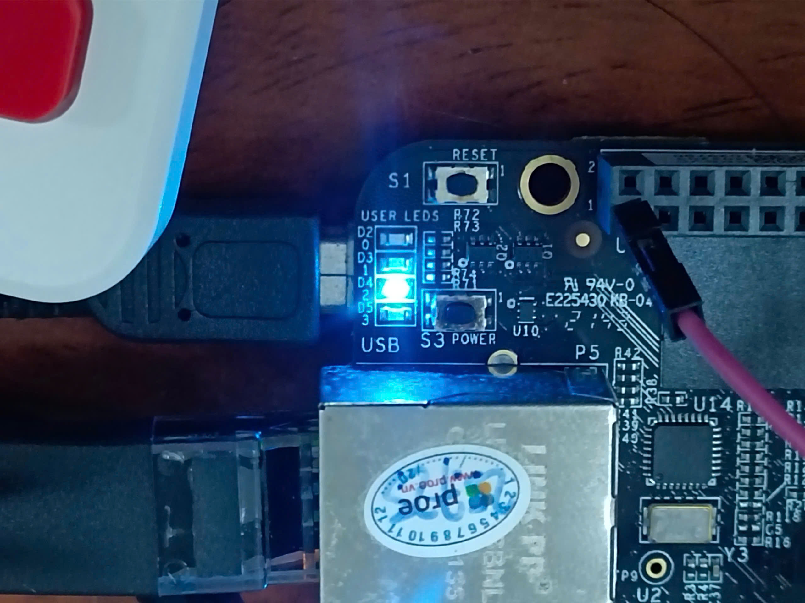

# Hướng dẫn viết application điều khiển chân GPIO
Application là program trên userspace, không được thêm vào kernel (như dạng driver)

Boot zImage lên BeagleBone
Đăng nhập

**Truy cập vào driver led có sẵn (để điều khiển led trên board)**
```bash
cd sys/class/leds
```
```
root@am335x-evm:/sys/class/leds# ls                                                                                                                                                           
beaglebone:green:heartbeat  beaglebone:green:mmc0  beaglebone:green:usr2  beaglebone:green:usr3  mmc0::  mmc1::         
```
Ta thấy BeagleBone đã cung cấp driver để điều khiển led cho user 
```
beaglebone:green:usr2  beaglebone:green:usr3
```

**Driver giúp điều khiển led D2, D3*

Ta truy cập vào led user 2
```bash
cd beaglebone:green:usr2 
```
Xam file brightness có gì
```bash
cat brightness 
```
```  
1     
```                                                  
Thử ghi 0 và 1 vào file brightness để xem led
```bash
echo 0 > brightness
echo 1 > brightness
```
*Vậy ghi 1 hoặc 0 vào file brightness để điều khiển led sáng/ tắt*

## Viết app cơ bản để điều khiển led
Viết app để ghi 0 và 1 vào file brightness

**Viết và build chưởng trình trực tiếp trên BBB**
```bash
cd /home/root
vi main.c    
```
trên BBB không có lệnh *vim*, nên dùng *vi*

**App ghi 0 hoặc 1 vào file brightness để bật tắt LED**
```C
#include <stdio.h>

void main()
{
        printf("start program\n");
        FILE* fp;
        fp = fopen("/sys/class/leds/beaglebone:green:usr2/brightness","w");
        if(fp == 0)
        {
                printf("File open failed");
                return;
        }
        fputs("1",fp);
        fclose(fp);
}
```
Build 
```bash
gcc ledcontrol.c -o LED_control
```
**App hiện lên để chọn 0 hoặc 1 (không cần sửa file)**
```C
#include <stdio.h>
void main()
{
        printf("start program\n");
        FILE* fp;
        fp = fopen("/sys/class/leds/beaglebone:green:usr2/brightness","w");
        if(fp == NULL)
        {
                printf("File open failed");
                return;
        }
        int a;
        printf("on/off : 1/0:");
        scanf("%d",&a);
        fprintf(fp,"%d",a);
        fclose(fp);
}
```
--------------------------------------------------------------------------------
## Bây giờ chúng ta viết app trên PC, dùng cross compiler để build chương trình chạy trên BBB
Viết chương trình trên PC, build cho chip ARM
Viết chương trình y hệt trên board, nhưng dùng cross compiler tròn SDK để build chạy trên BBB
```bash
source ~/ti-processor-sdk-linux-am335x-evm-09.03.05.02/linux-devkit/environment-setup-armv7at2hf-neon-oe-linux-gnueabi 
gcc main.c -o Ledcontrol
scp LED_control root@192.168.8.8:/home/root
```
Lên BBB
```bash
./LED_control -> led on/off
```
___
## Viết app dùng Linux API
Chúng ta đã viết app cơ bản để điều khiển LED, tuy nhiên chúng ta cần viết app bằng Linux API, để hệ thống hóa, dùng được trên nhiều chip, và nhiều lí do khác

**FULL CODE**
```c
#include <stdio.h>
#include <linux/gpio.h>
#include <fcntl.h>
#include <sys/ioctl.h>
#include <unistd.h>

int main()
{
        printf("Start Program: Led control\n");
        int res = 0;
        int gpio_fp = open("/dev/gpiochip0", O_RDWR);
        if (gpio_fp == -1)
        {
                printf("Open gpiochip0 failed");
                return -1;
        }
        struct gpio_v2_line_request gpio_line_req = 
        {
                .offsets = {28},
                .consumer = "LED demo",
                .config = {
                        .flags = GPIO_V2_LINE_FLAG_OUTPUT,
                        
                },
                .num_lines = 1,
        };
        res = ioctl(gpio_fp, GPIO_V2_GET_LINE_IOCTL, &gpio_line_req);

        if (res < 0)
        {
                printf("GPIO_V2_GET_LINE_IOCTL falied \n");
                goto X;
        }
        struct gpio_v2_line_values line_val =
        {
                .bits = 1,
                .mask = 1
        };
        
        res = ioctl(gpio_line_req.fd, GPIO_V2_LINE_SET_VALUES_IOCTL, &line_val);
        if(res < 0)
        {
                printf("IOCTL GPIO_V2_LINE_SET_VALUES_IOCTL failed \n");   
                goto Y;    
        }
        sleep(30);
Y:      close(gpio_line_req.fd);
X:      close(gpio_fp);
        return res;
}
```

**Linux cung cấp API**
ti-sdk ->boardsuport -> ti-linux-kernel -> include -> upai -> linux
```bash
cd /home/tieuchi/ti-processor-sdk-linux-am335x-evm-09.03.05.02/board-support/ti-linux-kernel-6.1.119+gitAUTOINC+c490f4c0fe-ti/include/uapi/linux
```

**Phân biệt *(uapi -> linux)* khác *(linux -> uapi)***

- uapi -> linux: thư viện user để viết application
- linux -> uapi: thư viện để viết kernel driver

Open ti-sdk ->boardsuport -> ti-linux-kernel -> include -> upai -> linux -> gpio.h
gpio.h là thư viện viết app điều khiển GPIO

**Open BBB**
**Lệnh show gpiochip info**
```bash
gpioinfo
```
Lệnh show device được điều khiển
```bash
ls /dev/
```
```
gpiochip0        ptycd  ptyr9  ptyw5  rfkill  ttyS3  ttyea  ttyt6  ttyy2
gpiochip1        ptyce  ptyra  ptyw6  rtc     ttyS4  ttyeb  ttyt7  ttyy3
gpiochip2        ptycf  ptyrb  ptyw7  rtc0    ttya0  ttyec  ttyt8  ttyy4
gpiochip3        ptyd0  ptyrc  ptyw8  shm     ttya1  ttyed  ttyt9  ttyy5
```

Open Project led control
```C
#include <stdio.h>
#include <linux/gpio.h>		//Thư viện điều khiển GPIO
#include <fcntl.h>		//library for open function
#include <sys/ioctl.h>
#include <unistd.h>

int open(const char *pathname, int flags);
int open(const char *pathname, int flags, mode_t mode); // if create new file
```
**Giải thích các thành phần**
- pathname: 
	+ "test.txt" -> normal text file.
	+ "/dev/gpiochip0" -> GPIO device.
	+ "/dev/ttyUSB0" -> UART device.
- flags:
	+ O_RDONLY ->read only.
	+ O_WRONLY -> write only.
	+ O_RDWR -> read and write.
- mode (optional);
	+ 0644 -> rw-r--r-- 
	+ 0600 -> rw------- 
	+ 0666 -> rw-rw-rw-

Ví dụ: 
```c
int gpio_fp = open("/dev/gpiochip0", O_RDWR);
```
___
**FD (file descriptor)**
Là một con số (ID) mà shell cấu hình cho từng file để có thể đọc ghi file, FD giống như con trỏ trỏ tới file, và ta đọc ghi giá trị vào file đó

FD mặc định thường có giá trị và ý nghĩa tương ứng
- 0: stdin (standard input) - keyboard
- 1: stdout (standard output) - terminal
- 2: stderr (standard error) - terminal
	
Sử dụng hàm *open()* để mở file, giá trị FD trả về:
- interger >= 0: success
- interger = -1: failed
___ 
**Để log in ra lỗi**

```c
#include <errno.h>

printf("open failed, errno = %d\n", errno); //errno is interger number
printf("Error string  = %s\n", strerror(errno)); //string error
```
**Mở device điều khiển gpiochip0**
```c
int chip_fd = open("/dev/gpiochip0", O_RDWR);

struct gpio_v2_line_request req = {
    .offsets = {28},	//line in gpiochip0 want control (GPIOchip0_line28)
    .consumer = "LED demo",	//label (gpio user name)
    .config = { .flags = GPIO_V2_LINE_FLAG_OUTPUT },	//line config (output/input, pull up/pull down...)
    .num_lines = 1, (number of pin want to use)
};
```
Tạo một biến req có kiểu dữ liệu struct *gpio_v2_line_request*, line 28  gpiochip0, output, tên "LED demo"
.config: flags you want for line
- GPIO_V2_LINE_FLAG_INPUT: line is an input
- GPIO_V2_LINE_FLAG_OUTPUT: line is an output
...
thông tin của flag nằm trong linux/gpio.h
___
**Hàm *ioctl***
ioctl: Hàm của linux dùng để gửi các lệnh đặc biệt tới các file đã mở (dev/...)

int ioctl(int fd, unsigned long request, ...);

*always need 3 parameter

- fd: FD opened
- request: special command code
	#define GPIO_V2_GET_LINEINFO_IOCTL _IOWR(0xB4, 0x05, struct gpio_v2_line_info)
	#define GPIO_V2_GET_LINEINFO_WATCH_IOCTL _IOWR(0xB4, 0x06, struct gpio_v2_line_info)
	#define GPIO_V2_GET_LINE_IOCTL _IOWR(0xB4, 0x07, struct gpio_v2_line_request)
	#define GPIO_V2_LINE_SET_CONFIG_IOCTL _IOWR(0xB4, 0x0D, struct gpio_v2_line_config)
	#define GPIO_V2_LINE_GET_VALUES_IOCTL _IOWR(0xB4, 0x0E, struct gpio_v2_line_values)
	#define GPIO_V2_LINE_SET_VALUES_IOCTL _IOWR(0xB4, 0x0F, struct gpio_v2_line_values)
	
- ...: additional parameter (pointer to struct include infomation)
Giá trị trả về (return)
- 0: success
- -1: failed

Ví dụ:
```c
res = ioctl(gpio_fp, GPIO_V2_GET_LINE_IOCTL, &gpio_line_req);
```
+ gpio_fd: FD of dev/gpiochip0
+ GPIO_V2_GET_LINE_IOCTL: request for control gpio
+ &gpio_line_req: pointerto struct 'gpio_v2_line_request'
___
**Hàm chọn line hoạt động và set on/off line**
```c
/**
 * struct gpio_v2_line_values - Values of GPIO lines
 * @bits: a bitmap containing the value of the lines, set to 1 for active
 * and 0 for inactive.
 * @mask: a bitmap identifying the lines to get or set, with each bit
 * number corresponding to the index into &struct
 * gpio_v2_line_request.offsets.
 */
struct gpio_v2_line_values {
	__aligned_u64 bits;
	__aligned_u64 mask;
};
```
**Giải thích các giá trị bits và mask**
**bits** là bitmap chứa giá trị logic (0/1) mà ta muốn set (khi output) hoặc đọc (khi input). 
- 1 = active (**LED sáng**, GPIO logic 1)
- 0 = inactive (**LED tắt**, GPIO logic 0)

**mask** là bitmap dùng để lựa chọn line nào sẽ được tác động.
- bit = 1: line này được set
- bit = 0: line này bỏ qua

Ví dụ
```C
offsets = {10, 11, 12}
num_lines = 3
/*
Nếu mask = 0b001 → chỉ thao tác line 10
Nếu mask = 0b100 → chỉ thao tác line 12
Nếu mask = 0b111 → tác động cả 3 line
*/
```
Ví dụ hàm 
```c
struct gpio_v2_line_values line_val =
{
        .bits = 1,
        .mask = 1
};
```
___
**Hàm đóng file, hủy FD**
close: system call from linux API
```c
#include <unistd.h>
int close(int fd);

	close(gpio_line_req.fd);
	close(gpio_fp);
```
*gpio_line_req.fd*  hay  *gpio_fp* là fd của các file đang mở


